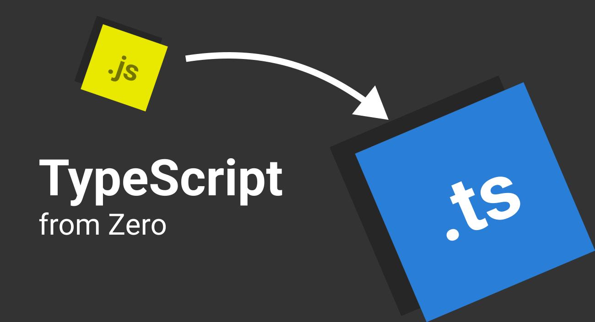

# TypeScript from Zero

This repository serves as an interactive guide to TypeScript.

It is built using Docusaurus.

## Features

- Interactive examples with solutions
  - Progress saved locally
- Explanation of TypeScript concepts from the ground up
- Best practices for using TypeScript

## Prerequisites

This course assumes that you have:

- Proficiency with JavaScript (or minimally any other language)

## Getting started

To get started with TypeScript from Zero, access the online guide [here](https://jeffsieu.com/typescript-from-zero).

## Expectations

### What this course is

- A guide to TypeScript syntax and best practices when using TypeScript in your codebase
- An interactive learning experience with practical examples

### What this course is not

- A guide to setting up TypeScript in your project
- A JavaScript tutorial

## Credits

This set of course materials was prepared by [Jeff Sieu](https://jeffsieu.com). 

Some of the examples and explanations were inspired by the [official TypeScript documentation](https://www.typescriptlang.org/docs/).

## Useful resources

- [TypeScript for JavaScript programmers](https://www.typescriptlang.org/docs/handbook/typescript-in-5-minutes.html)
- [TypeScript playground](https://www.typescriptlang.org/play)
- [Type Challenges (Interactive website)](https://type-challenges.github.io/)
- [Type Challenges (Github)](https://github.com/type-challenges/type-challenges)
